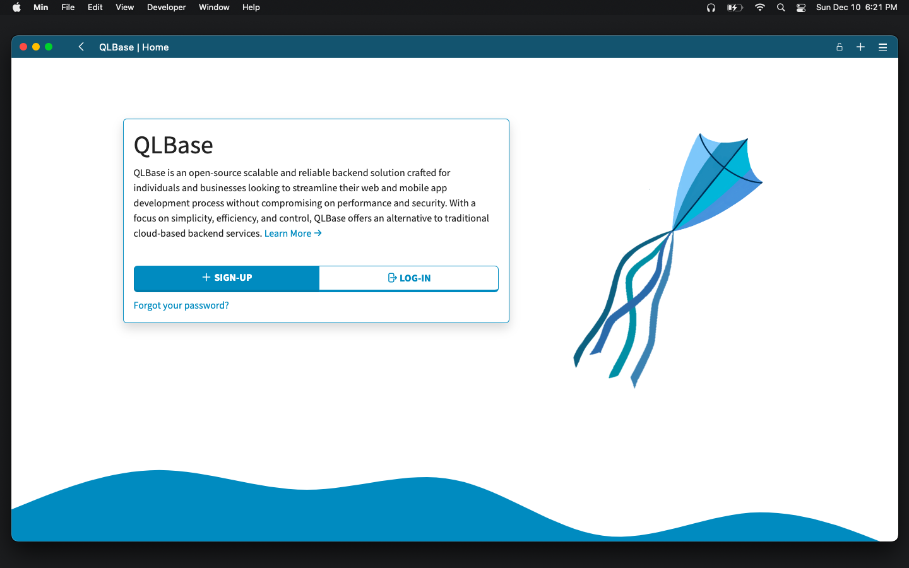
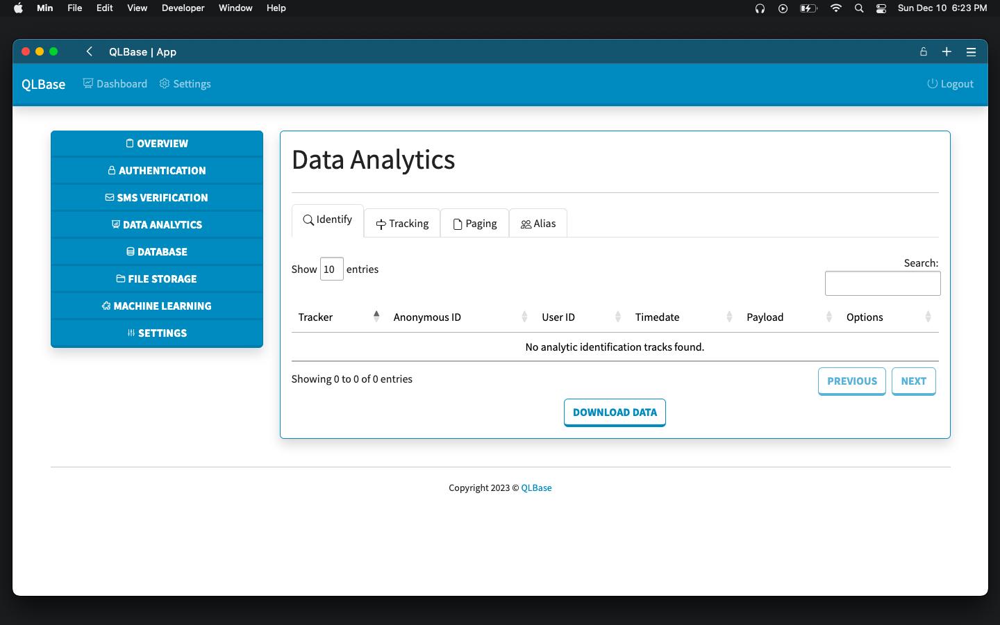
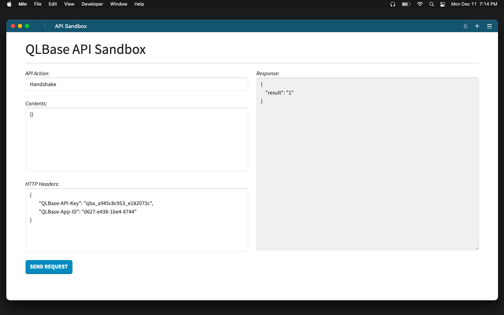

<p align="center">
    
    <h1 align="center">QLBase</h1>
</p>


[](https://github.com/nthnn/QLBase/issues)
[](https://github.com/nthnn/QLBase/stargazers)
[](https://github.com/nthnn/QLBase/blob/main/LICENSE)
[](https://github.com/nthnn/QLBase/blob/main/LICENSE)
[](https://github.com/nthnn/QLBase/blob/main/LICENSE)
<a href="https://www.buymeacoffee.com/nthnn"></a>

QLBase is a powerful open-source backend solution designed to provide scalable and reliable services for a wide range of applications. It offers a comprehensive set of features including user account authentication, SMS verification via OTP (One-Time Password), data analytics, database storage, file storage, and even machine learning as a software service. QLBase aims to be a flexible alternative to traditional cloud-based services, empowering developers to build robust applications with ease.

> Note: QLBase is a work-in-progress.

## Table of Contents


- [Features](#features)
    * [Authentication](#authentication)
    * [SMS Verification](#sms-verification)
    * [Data Analytics](#data-analytics)
    * [Database Storage](#database-storage)
    * [File Storage](#file-storage)
    * [Machine Learning](#machine-learning)
    * [Security](#security)
- [Deployment](#deployment)
    * [Software Requirements](#software-requirements)
    * [Usage](#usage)
    * [Configuration](#configuration)
    * [Troubleshooting](#troubleshooting)
- [Screenshots](#screenshots)
- [Contributing](#contributing)
    * [Issue Reporting](#issue-reporting)
    * [Pull Requests](#pull-requests)
- [Contributors](#contributors)
- [Donations](#donations)
- [License](#license)

## Features

QLBase offers a wide array of features that make it a versatile and powerful backend solution suitable for a variety of applications:

### Authentication

QLBase provides a robust authentication system that allows you to manage user accounts securely. It includes:

- **User Registration**: Easily register new users with customizable registration fields.

    Target URL:
    ```
    api/index.php?action=new_user
    ```

    Pseudo-Payload:
    ```json
    {
        "username": "<username>",
        "email": "<email>",
        "password": "<MD5 hashed string>",
        "enabled: "0|1"
    }
    ```

    Example Response:
    ```json
    {"result": "1"}
    // Successfully registered
    ```

- **Login**: Enable users to log in securely, supporting various authentication methods, including username/password and social logins.

    Target URL:
    ```
    api/index.php?action=login_username
    ```

    Pseudo-Payload:
    ```json
    {
        "username": "<username>",
        "password": "<MD5 hashed string>"
    }
    ```

    Example Response:
    ```json
    {"result": "0", "value": "0"}
    // Invalid login credentials
    ```

- **Account Disabling/Enabling**: You can disable and enable user accounts as needed. When an account is disabled, the user cannot log in until it's enabled again. This feature is particularly useful for handling suspicious or inactive accounts.

    Target URL:
    ```
    api/index.php?action=disable_user
    ```

    Pseudo-Payload:
    ```json
    {"username": "<username>"}
    ```

    Example Response:
    ```json
    {"result": "1"}
    // User was disabled
    ```

### SMS Verification

Easily integrate SMS verification into your application using QLBase's OTP service. Protect your user accounts with one-time passwords sent via SMS. QLBase provides SMS verification functionality using an Arduino UNO with a SIM900 Shield as the underlying SMS hardware. This setup allows you to seamlessly integrate SMS verification into your application for added security. QLBase's SMS verification features include:

- **OTP Generation**: Generate one-time passwords for user verification.

    Target URL:
    ```
    api/index.php?action=sms_verification
    ```

    Pseudo-Payload:
    ```json
    {
        "recipient": "+<country code><recipient number>",
        "support": "<tech support email address>"
    }
    ```

    Example Response:
    ```js
    {"result": "1", "value": "723181"}
    // The SMS was sent, and the OTP is 723181
    ```

- **SMS Delivery**: Send SMS messages containing OTPs to users' mobile numbers.

    Target URL:
    ```
    api/index.php?action=sms_is_validated
    ```

    Pseudo-Payload:
    ```json
    {
        "recipient": "+<country code><recipient number>"
        "code": "<generated verification code>"
    }
    ```

    Example Response:
    ```js
    {"result": "1", "value": "0"}
    // The OTP wasn't verified yet
    ```

- **Verification Endpoint**: Create an endpoint for users to enter OTPs and verify their phone numbers.

    Target URL:
    ```
    api/index.php?action=sms_validate
    ```

    Pseudo-Payload:
    ```json
    {
        "recipient": "+<country code><recipient number>",
        "code": "<generate verification code>"
    }
    ```

    Example Response:
    ```js
    {"result": "1"}
    // The OTP was successfully verified
    ```

### Data Analytics

QLBase includes powerful data analytics capabilities, enabling you to identify, track, and page data efficiently. It offers:

- **Data Identification**: QLBase allows you to tie user actions to specific individuals or anonymous IDs, making it easier to track and analyze user behavior.
- **Data Tracking**: Track user interactions and behaviors within your application for insightful analytics.
- **Data Paging**: Implement efficient data paging to handle large datasets without performance bottlenecks.

### Database Storage

Store and manage your data in QLBase's scalable and reliable database storage. Key features of QLBase's database storage include:

- **CRUD Operations**: Perform Create, Read, Update, and Delete operations on your data.
- **Data Validation**: Ensure data integrity with built-in validation mechanisms.

### File Storage

QLBase simplifies file management within your application. Its file storage service offers:

- **File Uploads**: Easily upload files, including images, documents, and media, with support for various file types.
- **File Retrieval**: Retrieve files securely using unique file identifiers.
- **Access Control**: Implement access control and permissions to restrict file access as needed.

### Machine Learning

Leverage machine learning as a software service through QLBase. Integrate AI capabilities into your applications without the hassle of managing complex infrastructure. QLBase's machine learning features include:

- **Model Integration**: Seamlessly integrate pre-trained machine learning models for tasks like image recognition, natural language processing, and more.
- **Custom Model Training**: Train and deploy custom machine learning models tailored to your specific application needs.
- **Scalable Infrastructure**: QLBase handles the scalability and deployment of machine learning models, ensuring high availability and performance.

### Security

Security is a top priority in QLBase:

- **Authentication Security**: Implement best practices for secure user authentication, including password hashing and protection against common attacks like CSRF and XSS.
- **Data Encryption**: Encrypt sensitive data to ensure confidentiality and integrity.

> Note: There are more API actions than the examples given above.

## Deployment

To simplify the deployment process of QLBase, a `deploy.sh` bash script is provided. This script is designed to package all the deployment-important files and assets and builds the back-end apps, ensuring a smooth deployment experience.

### Software Requirements

1. [XAMPP](https://www.apachefriends.org/) (or anything with Apache and MySQL) - This will deploy the QLBase on your local host machine.
2. [Go compiler](https://go.dev/) - For compiling back-end programs.


### Usage

1. Ensure that you have the necessary permissions to execute the script.

   ```bash
   sudo chmod +x deploy.sh
   ```

2. Run the deployment script:

    ```bash
    ./deploy.sh
    ```

The script will package all the required files and assets into file `qlbase.zip` on the current directory, making it easy to transfer and deploy QLBase to your target server.

<br/>

### Configuration

Before deploying QLBase, ensure you customize the `config.ini` file inside the `bin` folder with appropriate database connection details, server settings, and other configurations specific to your deployment environment.

```ini
[database]
server=localhost
username=root
password=
name=qlbase_apps
port=3306

[smtp]
host=<smtp host>
port=<smtp port>
from=<smtp email>
password=<smtp password>

[env]
home=http://localhost:8080/QLBase
```

Make sure to provide the correct values for the database and SMTP settings based on your deployment environment.

### Troubleshooting

- Permissions

    Prior to deployment of QLBase, it's important to set the appropriate permissions for executable files in the bin folder. You can do this by running the following command within the bin folder:

    ```bash
    sudo chmod -R 777 .
    ```

    This command ensures that all executable files have the necessary permissions to run effectively in your deployment environment.

- Serial Port

    For SMS verification to work correctly, grant permissions to the serial port `/dev/tty<port name>`. You can use the following command to set the permissions:

    ```bash
    chmod -R 777 /dev/tty<port name>
    ```

    This grants the required permissions for the SMS verification backend to communicate with the Arduino UNO firmware via the serial port.

## Screenshots

| <p align="center">QLBase Homepage</p>                |
|------------------------------------------------------|
|  |

| <p align="center">Application Dashboard</p>          |
|------------------------------------------------------|
|  |

| <p align="center">Application Overview</p>           |
|------------------------------------------------------|
|  |

| <p align="center">User Authetication Tab</p>         |
|------------------------------------------------------|
|  |

| <p align="center">QLBase API Sandbox</p>             |
|------------------------------------------------------|
|  |

## Contributing

All contributions are welcome to make QLBase even better. Whether you want to report a bug, suggest new features, or contribute code, your contributions are highly appreciated.

### Issue Reporting

If you encounter a bug, have a feature request, or want to suggest improvements, please open an issue on the [GitHub Issue Tracker](https://github.com/nthnn/QLBase/issues). Be sure to provide as much detail as possible, including steps to reproduce the issue if applicable.

### Pull Requests

If you want to contribute code to QLBase, follow these steps:

1. Fork the QLBase repository to your GitHub account. And then clone it to your local machine.

    ```bash
    git clone https://github.com/<your username>/QLBase.git
    ```

2. Create a new branch for your changes:

    ```bash
    git checkout -b feature/<your feature name>
    ```

3. You can now make changes to the repository.
4. Commit your changes:

    ```bash
    git add -A
    git commit -m "Add your meaningful commit message here"
    ```

5. Push your changes to your forked repository:

    ```bash
    git push origin feature/<your feature name>
    ```

6. Create a pull request (PR) from your branch to the main branch of the QLBase repository.
7. Your PR will be reviewed, and any necessary changes will be discussed and implemented.
8. Once your PR is approved, it will be merged into the main branch, and your contribution will be part of QLBase.

## Contributors

- [Nathanne Isip](https://github.com) - Original Author, Developer
- [Lady Selene](https://instagram.com/lady.selenee) - Artist, Illustrator

## Donations

QLBase is an open-source project and is voluntarily developed. If you find QLBase useful and would like to support its continued development and improvement, you can make a donation.

| [](https://www.paypal.com/paypalme/my/profile) | [](https://www.buymeacoffee.com/nthnn) |
|-------------------|----------------------------|

QLBase developers are profoundly grateful for your support! Your generosity allows us to continue developing and maintaining QLBase, making it better with each update. Your contribution is not just a donation; it's a vote of confidence in the project and a testament to the strength of the open-source community. Your contribution will help cover fund new features and support the community and developers (?) behind QLBase.

Thank you for being a part of our journey and helping us build a brighter future for QLBase!

## License

Your use of QLBase is subject to the terms and conditions of the following respective licenses. Make sure to comply with the licensing requirements when using or distributing QLBase components.

- The server-side code of QLBase is licensed under the [MIT License](LICENSE/MIT%20Public%20License.txt).
- The back-end software components used in QLBase are licensed under the [GNU GPL v3.0 License](LICENSE/GNU%20GPL%20v3.0.txt). Refer to the individual licenses of those components for specific details. And;
- The Arduino firmware in QLBase's SMS hardware is licensed under the [CERN OHL Permissive v2](LICENSE/CERN%20OHL%20Permissive%20v2.txt). Please review the firmware's licensing documentation for further information.